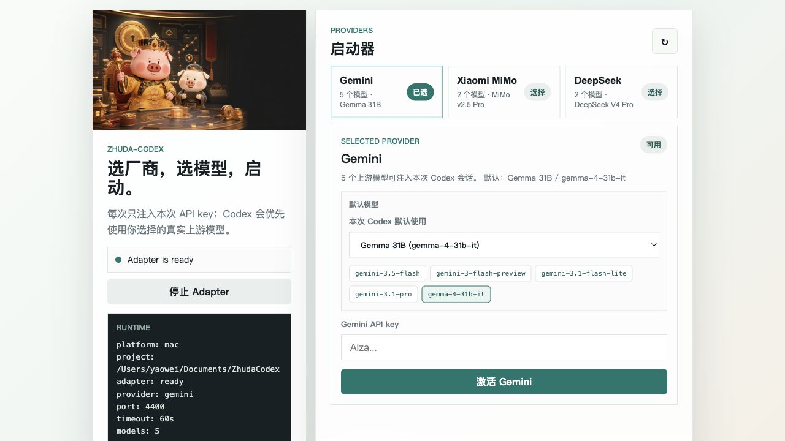

# Zhuda-Codex

Zhuda-Codex 是一个本地 Codex Desktop 启动器和模型适配器。它会打开一个轻量 Web 启动页，让你选择模型供应商、选择真实上游模型、输入本次会话 API key，然后通过本地 Responses 兼容适配器启动 Codex。

API key 只在本次启动时通过进程环境变量注入，不写入仓库，也不保存到本地源码目录。



## 现在的状态

- macOS 版本已经有 Web 启动器、独立 App 包、本地 adapter、模型菜单注入、错误边界处理。
- Windows 版本已经有 Web 启动器、供应商选择、API key 会话注入、portable 构建脚本。
- Windows 还没有完全追上 macOS 的模型菜单注入能力；如果 Codex 前端不刷新模型菜单，仍可能看到内置 GPT 名称，但请求会由本地 adapter 映射到你选择的上游模型。
- GitHub 仓库发布的是源码，不等于已经打好的 portable 成品包。Windows 想免安装运行，需要先用构建脚本生成 portable 包，或等待 Release zip。

## 支持的供应商

### Gemini

- Flash 3.5：`gemini-3.5-flash`
- Flash 3.0：`gemini-3-flash-preview`
- Flash Lite 3.1：`gemini-3.1-flash-lite`
- Pro 3.1：`gemini-3.1-pro`
- Gemma 31B：`gemma-4-31b-it`

### Xiaomi MiMo

- 支持接口模式：一般 API、Token Plan
- MiMo v2.5 Pro：`mimo-v2.5-pro`
- MiMo v2.5：`mimo-v2.5`

### DeepSeek

- DeepSeek V4 Pro：`deepseek-v4-pro`
- DeepSeek V4 Flash：`deepseek-v4-flash`

供应商和模型配置在 `providers.json` 中维护。启动器会把选择结果注入本次 Codex 会话，adapter 不会私自把你选择的模型切到其他模型。

## 快速开始

### macOS

```bash
cd /path/to/ZhudaCodex
./mac/Zhuda-Codex-Launcher.command
```

如果已经构建了 `mac/dist/Zhuda-Codex.app`，启动器会通过这个独立 App 启动 Codex，并在当前会话注入模型菜单。

### Windows 源码运行

```powershell
cd C:\path\to\ZhudaCodex
.\win\Zhuda-Codex-Launcher.cmd
```

源码运行要求本机已经安装 Codex Desktop，并且 Windows 脚本能找到本地 adapter 或 legacy adapter。

### Windows portable 构建

```powershell
cd C:\path\to\ZhudaCodex
powershell -NoProfile -ExecutionPolicy Bypass -File .\win\windows_zhuda_make_portable.ps1 -Zip
```

脚本会从本机已安装的 Windows Codex AppX 复制应用文件，并生成：

```text
Documents\ZhudaCodex\portable\Zhuda-Codex\
Documents\ZhudaCodex\portable\Zhuda-Codex-Portable.zip
```

生成后的 portable 包才是更接近“下载后直接运行”的版本。仓库源码本身不会包含 `app/Codex.exe`、本地 profile、运行日志或 API key。

## 目录结构

```text
ZhudaCodex/
  assets/brand/              品牌图、图标、启动器展示图
  docs/images/               README 展示截图
  launcher/                  macOS / Windows 共用 Web 启动器
  mac/                       macOS adapter、App 包装脚本、局域网日志接收器
  win/                       Windows 启动器、远程接入脚本、portable 构建脚本
  providers.json             供应商和模型清单
  tests/                     adapter 边界测试
```

## 不会提交的内容

这些内容是本机生成物，不应提交到 GitHub：

```text
.env
*.env
.venv/
dist/
build/
release/
out/
mac/dist/
mac/archive/runtime_logs/
*.log
*.jsonl
*.pid
*.zip
```

## 安全说明

- 仓库不应该包含任何真实 API key。
- 启动页输入的 key 只进入本次启动的进程环境变量。
- 日志会对常见 key 格式做脱敏。
- 开源前请跑敏感字符串扫描。

```bash
rg -n "AIza|sk-[A-Za-z0-9_-]{12,}|192\\.168\\.|api[_-]?key\\s*[:=]" \
  . \
  --glob '!mac/.venv/**' \
  --glob '!mac/dist/**' \
  --glob '!mac/archive/runtime_logs/**' \
  --glob '!**/.DS_Store'
```

扫描结果只应该出现占位符、正则、环境变量名或文档说明，不能出现真实密钥。

## 验证

```bash
python3 -m py_compile mac/zhuda_gemini_pool_adapter.py launcher/zhuda_web_launcher.py
node -c launcher/web/app.js
python3 -m json.tool providers.json >/dev/null
python3 tests/test_adapter_boundaries.py
```

Windows 脚本语法可在 Windows PowerShell 5.1 里运行：

```powershell
powershell -NoProfile -ExecutionPolicy Bypass -File .\win\Zhuda-Codex-Launcher.ps1 -Headless -NoLaunch -Provider gemini -Model gemma-31b -ApiKey test
```

## 常见问题

### 从 GitHub 拉下来为什么会报错？

因为 GitHub 仓库是源码，不是完整 portable 成品包。源码不会包含 Windows 的 `app/Codex.exe`，也不会包含 macOS 的 `mac/dist/Zhuda-Codex.app` 生成物。请先按平台构建，或使用后续 Release 里的 zip 包。

### 为什么 Codex 菜单里还是 GPT 名称？

某些 Codex Desktop 前端会锁死内置模型菜单。macOS 版本会尝试用本地模型菜单注入把真实模型显示出来；Windows 版本目前主要依靠 adapter 映射。即使菜单显示 GPT，实际请求仍会按照启动器注入的映射发给对应上游模型。

### adapter 会不会自动切模型？

不会。用户选择什么模型，这一轮就只打这个模型。上游报错时，adapter 会把上游原始错误和本地解释返回给 Codex，不会偷偷换到其他模型。

## 免责声明

Zhuda-Codex 是本地启动器和适配器实验项目，不是 OpenAI、Google、Xiaomi、DeepSeek 的官方产品。请只使用你有权使用的 API key 和品牌素材。
